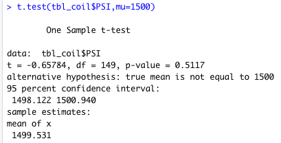

# MechaCar Statistical Analysis

## Overview
Statistical analysis using R Studio was performed on the MechaCar Prototype to investigate what variables correlate with its fuel efficiency and how its suspension coil compares to desired specifications and population values. In addition, a study was proposed to compare its performance with similar vehicles. 

## Miles Per Gallon (MPG) Regression
A multiple linear regression model of MechaCar was generated using the variables miles per gallon (mpg), vehicle length (ft), vehicle weight (lb), spoiler angle (degrees), and ground clearance (inch). Vehicle length, ground clearance and the y-intercept provided non-random (< 0.001 p-values) amounts of variance to mpg values (Figure 1).

Figure 1

The slope of the linear model was non-zero as evidenced by non-zero, positive coefficients for each variable (vehicle length: ~6.24, vehicle weight: ~0.001, spoiler angle: ~0.08, and ground clearance: ~3.66) and by the -1.08 y-intercept value (Figure 1). These indicated an overall positive correlation between the variables and mpg.

This linear model does not predict mpg of MechaCar prototypes effectively (beyond this dataset) even though the R-squared value (~0.70) indicates strong predictive ability. Reasons are that (1) the p-value of the y-intercept was significant (< 0.001), indicating that additional unknown variables also contributed to the variance of mpg values (Figure 1), and that (2) only 2 of the 4 known variables showed significant contributions to the variance.

## Suspension Coil Summary
See Figure 2 for a summary statistics table for the MechaCar's suspension coil variable in PSI.

Figure 2. Suspension Coil Variable (PSI).

The current manufacturing data (which showed a variance of 76.23; Figure 2) did meet a design specification of no more than 100 pounds per square inch for suspension coil variance. In addition, the mean and median values for the coil were similar, indicating no skew in the data. 

## Suspension Coil T-Test
The MechaCar's suspension coil's mean PSI was not statistically different from the mean population result of 1,500 PSI (p-value of 0.51 in a one-sample t-test; Figure 3).

Figure 3. Suspension Coil Variable Mean vs. Population Mean

## Study Proposal: Comparing MechaCar's Performance
To compare performance, MechaCar can be compared to other vehicles released in 2020 in the same vehicle class. Metrics for comparison would include price, city fuel efficiency, highway fuel efficiency, horsepower, and number of colour options. Questions to ask are: Is MechaCar less expensive? More fuel efficient? Does it have greater horsepower? And does it have a similar number of colour options as other vehicles? 

For price, hypotheses would be "equal to or higher price than others" (null) vs. "less expensive" (alternate). For both fuel efficiencies and horse power, hypotheses would be "equal to or lower fuel efficiency/horsepower" (null) vs. "higher fuel efficiency/horsepower" (alternate). Finally, for colour, hypotheses would be "similar number of colour options" (null) vs. "more/less colour options" (alternate). Hypotheses would thus be one-tailed, except for for colour which would be two-tailed. 

Normal distribution would be verified qualitatively or quantitatively (Shapiro-Wilk Normality Test) for the data for each metric. Then the One-Sample t-Test would be used to test these hypotheses. Since the hypotheses for colour are two-tailed, whereas the rest are one-tailed, the significance level would be < 0.05 for colour and < 0.025 for the remainder. Desired results would be significance levels < 0.025 for price, fuel efficiencies, and horsepower, indicating that the null hypotheses can be rejected (that MechaCar is superior to other vehicles). The desired significance level for colour would be 0.05 or greater, meaning that the null hypothesis cannot be rejected (that the number of colour options is not statistically different between MechaCar and other vehicles).

Data would need to be collected for all vehicles released in 2020 that are of the same vehicle class as MechaCar. These include vehicle make and model, price, city fuel efficiency, highway fuel efficiency, horsepower, and number of colour options per vehicle. 

## Data
### Software: RStudio 1.3.1056

### Sources
- [MechaCar_mpg.csv](data/MechaCar_mpg.csv) (for MPG Regression)
- [Suspension_Coil.csv](data/Suspension_Coil.csv) (for Suspension Coil Summary)